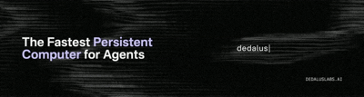

  

# Dedalus Labs

**The fastest persistent virtual machine for agents and beyond.**

Dedalus Labs is an AI research neolab currently building the fastest persistent VMs for AI agents.

Our flagship product, **Dedalus Machines**, is the fastest persistent computer for AI agents. It enables agents to complete long-running tasks on secure, full Linux VMs with zero cold starts, scalable storage, and billing only when your agent is running.

[Visit our website →](https://www.dedaluslabs.ai/)

## Quick Start

Get a Dedalus Machine up and running in a few minutes. [Read the docs →](https://docs.dedaluslabs.ai)

## Open Source SDKs

Official SDKs, developer tools, API specs for Dedalus and the Agents API.

<!-- sdk-repositories:start -->
<!-- This section is generated by scripts/update-profile-readme.ts. -->

### Dedalus SDKs

| Repository | Description | Stars | Issues | Pull Requests |
|------------|-------------|------:|-------:|----:|
| [dedalus-python](https://github.com/dedalus-labs/dedalus-python) | Official Python SDK for the Dedalus platform |  |  |  |
| [dedalus-typescript](https://github.com/dedalus-labs/dedalus-typescript) | Official TypeScript SDK for the Dedalus platform |  |  |  |
| [dedalus-go](https://github.com/dedalus-labs/dedalus-go) | Official Go SDK for the Dedalus platform |  |  |  |
| [dedalus-csharp](https://github.com/dedalus-labs/dedalus-csharp) | Official C# SDK for the Dedalus platform |  |  |  |
| [dedalus-java](https://github.com/dedalus-labs/dedalus-java) | Official Java SDK for the Dedalus platform |  |  |  |
| [dedalus-kotlin](https://github.com/dedalus-labs/dedalus-kotlin) | Official Kotlin SDK for the Dedalus platform |  |  |  |
| [dedalus-php](https://github.com/dedalus-labs/dedalus-php) | Official PHP SDK for the Dedalus platform |  |  |  |
| [dedalus-ruby](https://github.com/dedalus-labs/dedalus-ruby) | Official Ruby SDK for the Dedalus platform |  |  |  |
| [dedalus-sql](https://github.com/dedalus-labs/dedalus-sql) | Official SQL SDK for the Dedalus platform |  |  |  |
| [dedalus-openapi](https://github.com/dedalus-labs/dedalus-openapi) | Official OpenAPI specification for the Dedalus Cloud Services API |  |  |  |

### Developer Tools

| Repository | Description | Stars | Issues | Pull Requests |
|------------|-------------|------:|-------:|----:|
| [wingman](https://github.com/dedalus-labs/wingman) | scaling capability quotient |  |  |  |
| [dedalus-cli](https://github.com/dedalus-labs/dedalus-cli) | Official CLI for the Dedalus platform |  |  |  |
| [terraform-provider-dedalus](https://github.com/dedalus-labs/terraform-provider-dedalus) | The Dedalus Terraform Provider enables Terraform to manage resources on Dedalus Cloud Services |  |  |  |
| [homebrew-tap](https://github.com/dedalus-labs/homebrew-tap) | Homebrew Tap of Dedalus products |  |  |  |

### Agents API SDKs

| Repository | Description | Stars | Issues | Pull Requests |
|------------|-------------|------:|-------:|----:|
| [dedalus-agents-python](https://github.com/dedalus-labs/dedalus-agents-python) | Official Python SDK for the Dedalus Agents API |  |  |  |
| [dedalus-agents-typescript](https://github.com/dedalus-labs/dedalus-agents-typescript) | Official TypeScript SDK for the Dedalus Agents API |  |  |  |
| [dedalus-agents-go](https://github.com/dedalus-labs/dedalus-agents-go) | Official Go SDK for the Dedalus Agents API |  |  |  |
| [dedalus-agents-csharp](https://github.com/dedalus-labs/dedalus-agents-csharp) | Official C# SDK for the Dedalus Agents API |  |  |  |
| [dedalus-agents-java](https://github.com/dedalus-labs/dedalus-agents-java) | Official Java SDK for the Dedalus Agents API |  |  |  |
| [dedalus-agents-kotlin](https://github.com/dedalus-labs/dedalus-agents-kotlin) | Official Kotlin SDK for the Dedalus Agents API |  |  |  |
| [dedalus-agents-php](https://github.com/dedalus-labs/dedalus-agents-php) | Official PHP SDK for the Dedalus Agents API |  |  |  |
| [dedalus-agents-ruby](https://github.com/dedalus-labs/dedalus-agents-ruby) | Official Ruby SDK for the Dedalus Agents API |  |  |  |
| [dedalus-agents-sql](https://github.com/dedalus-labs/dedalus-agents-sql) | Official SQL SDK for the Dedalus Agents API |  |  |  |
| [dedalus-agents-openapi](https://github.com/dedalus-labs/dedalus-agents-openapi) | Official OpenAPI specification for the Dedalus Agents API |  |  |  |
| [dedalus-agents-cli](https://github.com/dedalus-labs/dedalus-agents-cli) | Official CLI for the Dedalus Agents API |  |  |  |
<!-- sdk-repositories:end -->

## Where to Find Us

Events: [Partiful](https://partiful.com/u/X3WJoV6DIpK6BIj8SNPj) · [Luma](https://luma.com/user/dedaluslabs)

Social: [Discord](https://discord.com/invite/RuDhZKnq5R) · [X](https://x.com/dedaluslabs) · [YouTube](https://www.youtube.com/@DedalusLabs) · [LinkedIn](https://www.linkedin.com/company/dedalus-labs) · [Instagram](https://www.instagram.com/dedaluslabs/)

Merch: [Store](https://www.dedaluslabs.ai/store) · [Archives](https://www.instagram.com/archives.dedalus/)

Support: [support@dedaluslabs.ai](mailto:support@dedaluslabs.ai)

## Philosophy

We are building the future of agents and AI from the ground up. We believe the substrate of that future should belong to everyone. Closed systems concentrate power; open ones compound it. So we build in the open, and we build with a community—the infrastructure agents run on will be the most important infrastructure ever built, and the only safe way to build it is in the light, together.

The future is in all of our hands; this is Dedalus's invitation for you to build alongside us. Give your agent wings.

**Mission:** [dedaluslabs.ai](https://www.dedaluslabs.ai/)
